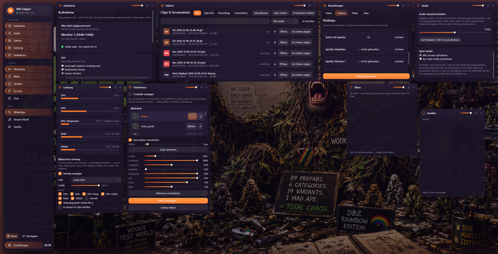
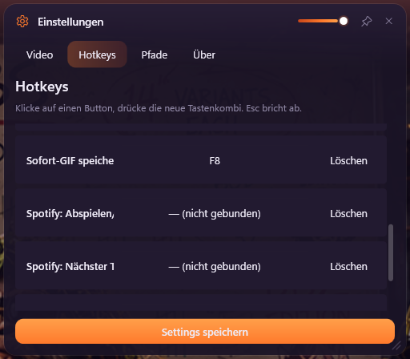
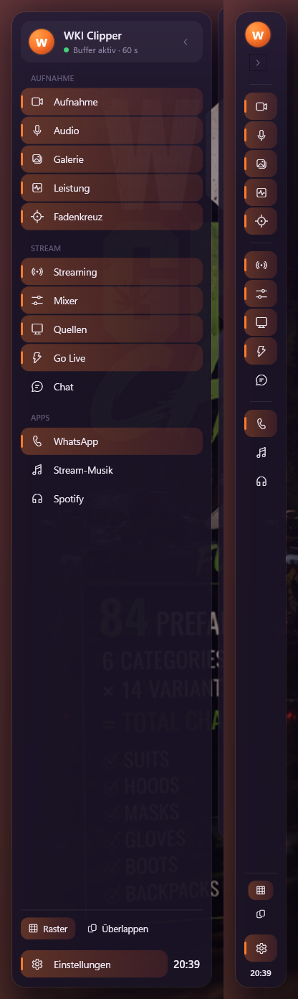
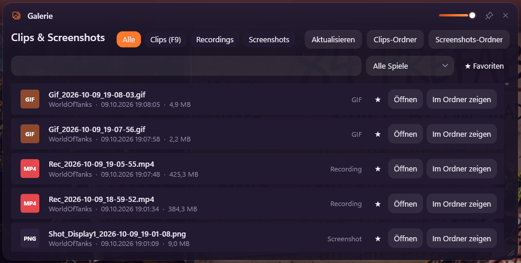
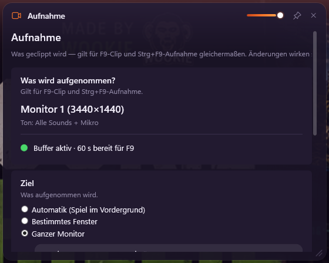
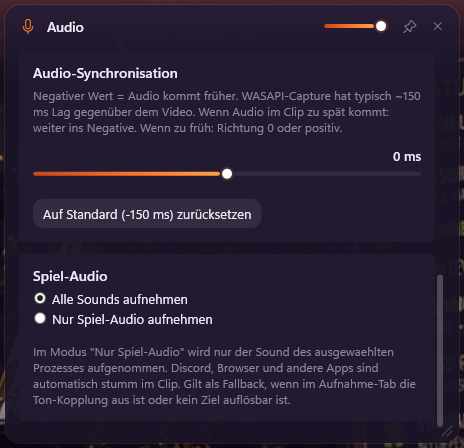
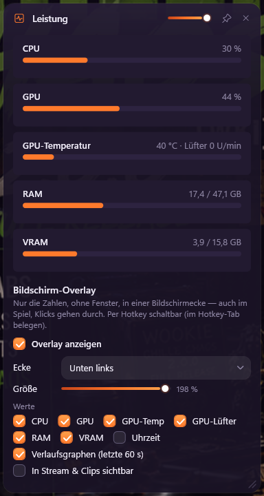
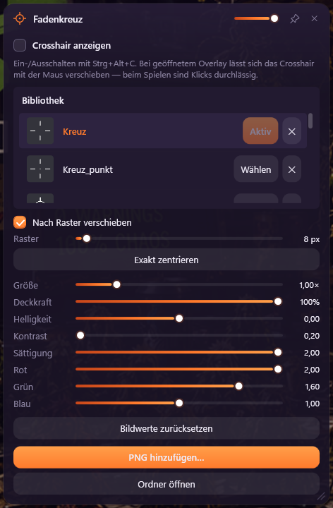

# WKI Clipper

Replay clipper, screen recorder and gaming overlay for Windows — one tray app instead of a
pile of tools. Instant replay, an Xbox-style widget board with OBS control, Spotify and
WhatsApp, a performance overlay and a crosshair. No account, no telemetry, no cloud.

**[Download the latest release](https://github.com/WKImods/WKI-Clipper/releases/latest)**



<sub>The widget board with `Ctrl+Alt+G`. The empty space in the middle is the WhatsApp widget —
it is invisible to every capture, this screenshot included. The UI starts in German;
switch to English under Settings → About.</sub>

## Hotkeys

| Hotkey | Action |
|--------|--------|
| `F9` | Save the last 15–180 s as MP4 (instant replay) |
| `F8` | Save the last seconds as a GIF |
| `F10` | Screenshot of the active monitor (PNG) |
| `Ctrl+F9` | Start/stop manual recording |
| `Ctrl+F10` | Pause/resume the replay buffer |
| `Ctrl+Alt+G` | Open/close the widget board |
| `Ctrl+Alt+C` | Show/hide the crosshair |
| *(unbound)* | Spotify play/pause, next, previous · performance overlay on/off |

All hotkeys are rebindable in Settings → Hotkeys (press-to-bind, with collision checks).



## The widget board



`Ctrl+Alt+G` opens the board over the game: a dimmed backdrop, a **sidebar** on the left
and the widgets you have open. Every widget is its own frameless window — drag it, resize
it, **pin** it to keep it on screen while you play, or close it. A transparency slider in
each title bar dials a pinned widget down; it turns fully opaque again under the pointer.

**Sidebar.** Widgets are grouped into *Capture*, *Stream* and *Apps*; open ones are
highlighted, the WhatsApp unread count shows as a pill. The header shows what the capture
is doing right now (buffer active · 60 s / paused / recording with its running time), the
footer holds the layout switches, settings and the clock. It collapses to an icon rail.

**Grid.** With *Grid* on, widgets snap to a grid and to each other's edges while you drag
or resize them (hold `Shift` to place freely). By default they never overlap — a dropped
widget moves to the nearest free spot, a growing one pushes its neighbours aside.
*Overlap* allows stacking while keeping the snapping.

**Any display scaling.** Places are stored relative to the screen, sizes in scalable units:
switching Windows between 100, 125 and 150 % keeps your layout where you put it.

<br clear="right">

| Section | Widget | What it does |
|---------|--------|--------------|
| Capture | **Capture** | What gets clipped next, target mode, window picker, audio coupling |
| | **Audio** | Devices, levels, gain, sync offset, separate mic track |
| | **Gallery** | Clips, recordings, GIFs and screenshots — search, favourites, game filter |
| | **Performance** | CPU, GPU, GPU temperature and fan, RAM, VRAM — plus the on-screen overlay |
| | **Crosshair** | PNG crosshair overlay |
| Stream | **Streaming** | Software stream deck for OBS |
| | **Mixer** | Fader, dB readout and mute per OBS audio input, synced both ways |
| | **Sources** | Scene switcher and per-source visibility for the current scene |
| | **Go Live** | Preflight checklist, stream health, one-click start sequence |
| | **Chat** | Read-only Twitch chat, click-through when pinned |
| Apps | **WhatsApp** | WhatsApp Web, hidden from stream and clips |
| | **Stream music** | Music player for the stream with separate stream/monitor levels |
| | **Spotify** | Your Spotify app: compact player or the full Spotify interface |



## Capture

<p>
  
  
</p>

| Mode | Behaviour |
|------|-----------|
| **Automatic** | Follows the window you click (after ~1.5 s dwell). A running `Ctrl+F9` recording stays on the window it started on; an `F9` clip only ever contains one window, never two mixed. |
| **Specific window** | Occlusion-proof window capture (Windows Graphics Capture) — keeps recording the window even when it is covered. The mode for a main game that must never switch. |
| **Whole monitor** | A whole display via Desktop Duplication (`ddagrab`). |

- **Game-only audio:** the WASAPI process-loopback API records just the game (plus your
  microphone) — no Discord, no browser. Optional second audio track for the mic.
- **Per-game folders:** clips, recordings, GIFs and screenshots land in one subfolder per
  game (`Clips\Arma Reforger\…`). The name comes from the program's version info, not the
  window title, so the Arma Reforger Workbench gets its own folder. Read with the most
  limited process right Windows offers — the game's memory is never touched.
- **Hardware encoding:** codecs are detected at startup with a real test encode.

| Codec | GPU |
|-------|-----|
| `h264_amf` / `hevc_amf` / `av1_amf` | AMD (default on AMD) |
| `h264_nvenc` / `hevc_nvenc` / `av1_nvenc` | NVIDIA |
| `h264_qsv` / `hevc_qsv` / `av1_qsv` | Intel |
| `libx264` / `libx265` | CPU fallback |

AMD's own driver-level capture (`vsrc_amf`) is an opt-in in `settings.json`
(`Video.UseAmfCapture`). It only applies to whole-monitor capture at native resolution with
an AMF encoder, is off by default and is switched off automatically whenever something on
screen must stay out of the footage (crosshair, WhatsApp, the hidden performance overlay),
because it ignores Windows' capture exclusion.

## Performance overlay

Bare numbers — no window, a soft shadow for legibility — in a screen corner over the game,
always click-through. Pick the corner, the size (75–200 %) and the values (CPU, GPU, GPU
temperature, fan, RAM, VRAM, clock), optionally with 60-second history graphs.
**Hidden from stream and clips by default**; a tick shows it for benchmark videos.

GPU temperature, fan and VRAM size come from the same driver interface Task Manager uses —
user mode, no admin, no driver of our own, nothing an anti-cheat could object to. CPU
temperature is deliberately not shown: Windows only exposes it through a kernel driver.



## Crosshair

Import your own PNGs into a small library, pick one, place it, toggle it with `Ctrl+Alt+C`.



- **Never in the footage** — excluded from every capture, while you still see it.
- **Click-through while playing**; draggable only while the board is open.
- **Snap to grid** anchored at the monitor centre, so dead centre is always reachable.
- **1:1 screen pixels** at any display scaling — it neither grows nor blurs at 150 %.
- Size, opacity, brightness, contrast, saturation and per-channel colour gain.

<br clear="right">

## WhatsApp

The official WhatsApp Web inside a widget, linked once by QR code like any browser.

- **Private by default:** invisible in stream, clips, recordings and screenshots, while you
  still see it; switchable in its toolbar. Sounds are muted by default for the same reason.
- **No pop-ups over the game:** the only signal is the unread count in the sidebar.
- Links from chats open in your normal browser (http/https only); downloads go to your
  downloads folder, and the notification opens the folder, never the file.
- No unofficial WhatsApp APIs — no ban risk.

## Spotify

- **Compact view** for pinning over a game: cover, title, seekable progress, play/skip,
  shuffle, repeat and Spotify's own volume. It controls **your Spotify app** through the
  Windows media session — no developer account, no extra login.
- **Full view:** the Spotify web interface (search, playlists, library) with your own
  account, as a remote for the app. If the web player starts playing by itself, the widget
  says so and tells you how to switch back to your PC.
- Unbound hotkeys for play/pause, next and previous.

## Streaming (OBS)

Streaming, Mixer, Sources and Go Live talk to OBS through its built-in WebSocket server
(v5, OBS 28+: Tools → WebSocket Server Settings, default port 4455). The password is stored
DPAPI-encrypted. OBS may start after the clipper — the connection re-establishes by itself.

- **Streaming:** a button grid — switch scene, start/stop stream or recording, OBS replay
  buffer, mute inputs, toggle sources, virtual camera, studio transition. Per tile: label,
  colour, action and an optional global hotkey. Live badges (LIVE/REC/MUTE/BUFFER).
- **Mixer / Sources:** volume, mute, scenes and source visibility without focusing OBS,
  synced both ways and event-driven.
- **Go Live:** a traffic-light checklist (OBS connected, mic live, replay buffers, scene,
  free disk on both the clips and the OBS recording drive), stream health while live
  (uptime, bitrate, frames dropped *right now*) with a warning even when the widget is
  closed, and a confirmed start sequence: start scene → stream → replay buffer → countdown
  → target scene, aborting honestly if OBS rejects the start.
- **Chat:** anonymous read-only Twitch chat — no OAuth, just the channel name. Colours and
  badges, raids/subs/gifts as highlighted blocks, messages addressing you tinted, a pop-up
  for raids and gifted subs, and a status dot that turns amber when the chat goes silent.
- **Stream music:** plays a folder into the stream device (e.g. a virtual cable) with an
  optional monitor output at its own level; writes "now playing" for an OBS text source.

## Installation

Download `WKI_Clipper_Setup_X.X.X.exe` from the
[latest release](https://github.com/WKImods/WKI-Clipper/releases/latest) and run it: a
per-user install (no admin) with a self-contained .NET 8 runtime and FFmpeg with all
hardware encoders. The uninstaller keeps your clips and settings.

- **Windows 10 (2004) or 11, 64-bit.** WhatsApp and Spotify's full view need the Microsoft
  Edge WebView2 Runtime, which ships with current Windows 10/11.
- **SmartScreen:** the installer is not code-signed, so Windows may warn on first launch —
  *More info → Run anyway*.

### Build from source

Prerequisites: .NET 8 SDK, FFmpeg (`winget install Gyan.FFmpeg`), Inno Setup 6.

```powershell
git clone https://github.com/WKImods/WKI-Clipper.git
cd WKI-Clipper
.\build.ps1
```

This produces `installer_output\WKI_Clipper_Setup_X.X.X.exe`, the same installer as in the
releases.

Dev build without the installer:

```powershell
dotnet build WKI_Clipper.sln -c Debug
.\WKI_Clipper\bin\Debug\net8.0-windows10.0.22621.0\WKI_Clipper.exe
```

## Settings

Everything is configurable in the board. The file behind it is
`%APPDATA%\WKI_Clipper\settings.json` (versioned and migrated automatically):

```jsonc
{
  "Capture":      { "Mode": "Auto", "TargetProcessName": null, "CoupleAudio": true },
  "Audio":        { "RecordMicrophone": true, "RecordSystemSound": true },
  "Video":        { "Resolution": "Native", "Framerate": 60, "Codec": "h264_amf", "UseAmfCapture": false },
  "ReplayBuffer": { "Enabled": true, "DurationSeconds": 60 },
  "Output":       { "SortByGame": true },
  "Behavior":     { "Language": "Deutsch" }
}
```

The UI is fully bilingual (German by default, English under Settings → About) and switches
immediately, without a restart.

## Architecture

```
WKI_Clipper.exe (.NET 8 / WPF, tray)
  Capture
  +-- CaptureTargetResolver    what gets captured, with which audio (single source of truth)
  +-- WgcWindowCapture         occlusion-proof window capture (WGC + D3D11)
  +-- VideoPipeService         BGRA frames -> named pipe -> FFmpeg
  +-- AudioPipeService         WASAPI loopback + mic -> mix -> named pipe
  +-- ProcessLoopbackCapture   game-only audio (WASAPI process loopback)
  +-- ReplayBufferService      FFmpeg segment ring buffer (F9 / GIF)
  +-- ManualRecordingService   FFmpeg single-file recording
  +-- ScreenshotService        ddagrab grab with GDI fallback
  +-- GameContext              which game a capture belongs to (per-game folders)
  Board
  +-- WidgetHost               board, sidebar, widgets, pinning, crosshair and overlays
  +-- WidgetCatalog            sections, labels, icons, status line (pure, tested)
  +-- WidgetLayout             grid, snapping, free-spot search, scale-independent places
  +-- DisplayGeometry          physical-pixel placement at any display scaling
  +-- WebAppHost               WebView2 for WhatsApp/Spotify (one browser, separate profiles)
  +-- SpotifyMediaService      Spotify via the Windows media session + per-app volume
  +-- PerformanceMonitorService  counters + GPU sensors (D3DKMT), only while visible
  Streaming
  +-- ObsWebSocketService      OBS control via obs-websocket v5 (auto-reconnect, events)
  +-- TwitchChatService        anonymous Twitch IRC over WebSocket
  +-- MusicPlayerService       stream music (NAudio, two outputs)
  +-- PreflightChecks / StreamHealth   pure go-live checks and stream math (tested)
```

## Known limits

- **Legacy exclusive fullscreen** cannot be captured per window; the clipper falls back to
  the game's monitor. Borderless windowed works everywhere.
- **Anti-cheat:** nothing is injected into or read from the game process — only Windows'
  own capture APIs. Should be fine with BattlEye/EAC, but there is no guarantee.
- **Replay length** can deviate by up to ~5 s because of segment boundaries.
- **CPU temperature** is not shown (needs a kernel driver).
- **Flicker with the board open?** Windows' *content adaptive brightness* reacts to the dim
  backdrop and can make the whole screen flicker on OLED/VRR displays — turn it off in
  Settings → System → Display.

## License

[MIT](LICENSE)
