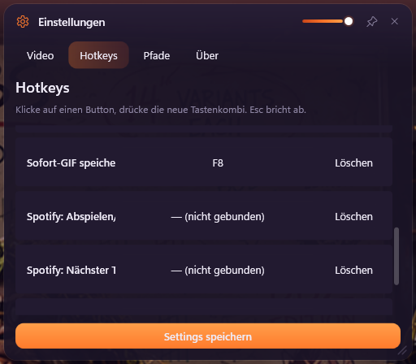

# WKI Clipper

Replay clipper, screen recorder and gaming overlay for Windows — one tray app instead of a
pile of tools. Instant replay of up to 30 minutes, a gallery with notes, trimming and
one-click Discord compression, an Xbox-style widget board with OBS control, Spotify and
WhatsApp, a performance overlay with FPS, a crosshair with per-game profiles and clip combos
on your controller. No account, no telemetry, no cloud.

**[Download the latest release](https://github.com/WKImods/WKI-Clipper/releases/latest)**


<sub>The widget board with `Ctrl+Alt+G`. The empty space in the middle is the WhatsApp widget —
it is invisible to every capture, this screenshot included. The UI starts in German;
switch to English under Settings → About.</sub>

## Hotkeys

| Hotkey | Action |
|--------|--------|
| `F9` | Save the last 15 s – 30 min as MP4 (instant replay) |
| `F8` | Save the last seconds as a GIF |
| `F10` | Screenshot of the active monitor (PNG) |
| `Ctrl+F9` | Start/stop manual recording |
| `Ctrl+F10` | Pause/resume the replay buffer |
| `Ctrl+Alt+G` | Open/close the widget board |
| `Ctrl+Alt+C` | Show/hide the crosshair |
| *(unbound)* | Spotify play/pause, next, previous · performance overlay on/off |

All hotkeys are rebindable in Settings → Hotkeys (press-to-bind, with collision checks).



### Controller

Hold a button combination on an Xbox controller to run the same action as the hotkey —
also while the game has focus. Out of the box, **View + Menu** saves a clip like `F9`.

- **Actions:** save clip (`F9`), screenshot (`F10`) and recording start/stop (`Ctrl+F9`),
  each with its own combo.
- **Settings → Hotkeys → Controller:** the *Enable controller combos* switch, the hold time
  and *Learn combo* per action — hold at least two buttons for one second; a combo that
  another action already uses is refused.
- **Hold time:** 300–1500 ms (default 500 ms) — longer means fewer accidental triggers.
  After it fires, a combo is spent until every one of its buttons is released.
- **Read-only:** the pad is polled through XInput — no rumble, no input injection.
  Xbox/XInput controllers only: PlayStation pads are not supported yet, and Share and
  Guide are invisible to XInput. The game sees the buttons too, so pick a combo that is
  harmless there.

## The widget board


`Ctrl+Alt+G` opens the board over the game: a dimmed backdrop, a **sidebar** on the left
and the widgets you have open. Every widget is its own frameless window — drag it, resize
it, **pin** it to keep it on screen while you play, or close it. A transparency slider in
each title bar dials a pinned widget down; it turns fully opaque again under the pointer.

**Sidebar.** Widgets are grouped into *Capture*, *Stream* and *Apps*; open ones are
highlighted, the WhatsApp unread count shows as a pill. The header shows what the capture
is doing right now (buffer active · 60 s / paused / recording with its running time), the
footer holds the layout switches, settings and the clock. It collapses to an icon rail.

**Grid.** With *Grid* on, widgets snap to a grid and to each other's edges while you drag
or resize them (hold `Shift` to place freely). By default they never overlap — a dropped
widget moves to the nearest free spot, a growing one pushes its neighbours aside.
*Overlap* allows stacking while keeping the snapping.

**Any display scaling.** Places are stored relative to the screen, sizes in scalable units:
switching Windows between 100, 125 and 150 % keeps your layout where you put it.

<br clear="right">

| Section | Widget | What it does |
|---------|--------|--------------|
| Capture | **Capture** | What gets clipped next, target mode, window picker, audio coupling |
| | **Audio** | Devices, levels, gain, sync offset, separate mic track, sound cues |
| | **Gallery** | Clips, recordings, GIFs and screenshots — search, favourites, notes, trim, Discord compress, game filter |
| | **Performance** | CPU, GPU, GPU temperature and fan, RAM, VRAM, FPS — plus the on-screen overlay |
| | **Crosshair** | PNG crosshair overlay, optionally with its own look per game |
| Stream | **Streaming** | Software stream deck for OBS |
| | **Mixer** | Fader, dB readout and mute per OBS audio input, synced both ways |
| | **Sources** | Scene switcher and per-source visibility for the current scene |
| | **Go Live** | Preflight checklist, stream health, one-click start sequence |
| | **Chat** | Read-only Twitch chat, click-through when pinned |
| Apps | **WhatsApp** | WhatsApp Web, hidden from stream and clips |
| | **Stream music** | Music player for the stream with separate stream/monitor levels |
| | **Spotify** | Your Spotify app: compact player or the full Spotify interface |


## Capture

<p>
  
  
</p>

| Mode | Behaviour |
|------|-----------|
| **Automatic** | Follows the window you click (after ~1.5 s dwell). A running `Ctrl+F9` recording stays on the window it started on; an `F9` clip only ever contains one window, never two mixed. |
| **Specific window** | Occlusion-proof window capture (Windows Graphics Capture) — keeps recording the window even when it is covered. The mode for a main game that must never switch. |
| **Whole monitor** | A whole display via Desktop Duplication (`ddagrab`). |

- **Game-only audio:** the WASAPI process-loopback API records just the game (plus your
  microphone) — no Discord, no browser. Optional second audio track for the mic.
- **Per-game folders:** clips, recordings, GIFs and screenshots land in one subfolder per
  game (`Clips\Arma Reforger\…`). The name comes from the program's version info, not the
  window title, so the Arma Reforger Workbench gets its own folder. Read with the most
  limited process right Windows offers — the game's memory is never touched.
- **Sound cues:** short sounds when a clip or GIF save starts, a screenshot is taken, a
  recording starts or stops — and when something goes wrong. The clip sound plays at the key
  press, not when the file is finished. Each cue has its own switch; volume, output device
  and your own WAV per cue are in the Audio widget → *Sound cues*. Over speakers the
  microphone can pick a cue up (and in *Capture all sounds* mode it can land in the next
  clip) — headphones recommended.
- **Hardware encoding:** codecs are detected at startup with a real test encode.

| Codec | GPU |
|-------|-----|
| `h264_amf` / `hevc_amf` / `av1_amf` | AMD (default on AMD) |
| `h264_nvenc` / `hevc_nvenc` / `av1_nvenc` | NVIDIA |
| `h264_qsv` / `hevc_qsv` / `av1_qsv` | Intel |
| `libx264` / `libx265` | CPU fallback |

AMD's own driver-level capture (`vsrc_amf`) is an opt-in in `settings.json`
(`Video.UseAmfCapture`). It only applies to whole-monitor capture at native resolution with
an AMF encoder, is off by default and is switched off automatically whenever something on
screen must stay out of the footage (crosshair, WhatsApp, the hidden performance overlay),
because it ignores Windows' capture exclusion.

### Replay buffer

`F9` saves the last **15 seconds to 30 minutes** — pick the length under Settings → Video →
Replay buffer. The same page shows a live estimate of what that length costs in RAM or on
disk (about 6–7 GB for 30 minutes at the default quality, up to ~25 GB at *Very high*).

- **Buffer storage:** *Automatic* keeps the lookback in **RAM** — no files, no SSD wear,
  nothing in Explorer — while it fits the RAM budget (the smaller of 2 GB and 15 % of your
  RAM) and the machine has room for a game beside it; the page shows how long that is on
  your PC. Longer lookbacks go to a **hidden ring of segment files** in the buffer folder.
  *Memory (RAM)* and *Disk (hidden buffer folder)* force one or the other.
- **AV1 always uses the disk** — it cannot be buffered in RAM.
- **Low RAM or disk space:** when free RAM runs low, the RAM lookback is shortened (oldest
  footage first) so the game keeps its memory, and *Automatic* then picks the disk at new
  starts for 7 days — or until you change the storage setting. On disk, a length that does
  not fit is shortened — or the buffer refuses to start — instead of filling the drive.
- **Gaps are marked, never hidden:** time missing inside the lookback — an Alt-Tab to
  another window in *Automatic* mode, a `Ctrl+F9` recording, a buffer restart — is bridged.
  The parts are joined into one MP4 with a chapter per part, and an automatic gallery note
  names every gap. Footage of another window or with other encoding settings is never
  joined. For gap-free evidence use *Whole monitor* or *Specific window*.
- **Long clips:** saving 30 minutes takes 20–90 s depending on the disk, with a progress
  toast; `F8` and `F9` are blocked until it is done.

### Per-game profiles

The clipper knows which game is in front: a program whose window covers its whole monitor
(fullscreen or borderless), or the program you chose as *Specific window* — never browsers,
chat apps, launchers, editors or Windows' own windows. Only the window and the program's
file are looked at, with the most limited process right Windows offers. A game can have its
own:

- **F9 length:** Settings → Video → *Own length per game* — press *Add current game* while
  it is in front, then pick the length. The buffer always holds the longest of all lengths,
  so switching games never restarts it; each `F9` press saves the length of the game the
  clip belongs to (the window being captured, else the game in front), capped by what the
  buffer holds.
- **Crosshair look and position:** see [Crosshair](#crosshair).

No game detected, or a game without a profile: the standard settings apply. The same
detection drives the overlay's *Only show while a game is detected*, the FPS measurement
and Discord's *Only compress while no game is in the foreground*.

## Gallery & editing

The Gallery widget lists clips, recordings, GIFs and screenshots. The less common actions
sit in the `…` menu of each row (also on right-click).

- **Favourites and notes:** star a file (★) and filter with *Favorites*. A note of up to 500
  characters becomes the row's title and is searched along with the file name; F9 clips with
  gaps get an automatic note. Notes live in `%APPDATA%\WKI_Clipper\gallery-meta.v2.json`,
  written atomically with a backup — a locked or damaged file is never overwritten, and a
  banner warns until everything is saved.
- **Trim…** opens the clip editor: preview with scrubbing and frame stepping, start and end
  marks (`I` / `O`) and two modes — *Fast (lossless)* copies the stream, so the start snaps
  back to the previous keyframe; *Exact (re-encode)* cuts to the frame and takes longer
  (H.264 on the GPU; a picture wider than 4096 px, e.g. 32:9 monitors, is encoded on the
  CPU because hardware H.264 cannot open it).
  The result lands next to the original as `<name>_cut.mp4` with its note and star. The
  original stays unless you tick *Move the original to the Recycle Bin afterwards* (the
  Recycle Bin, never a permanent delete: on a drive without one — USB sticks, network
  drives — or when the file would not fit in it, the original is kept). MP4 videos only.
- **Discord 20 MB / Discord 500 MB:** re-encodes the clip to fit an upload limit (H.264,
  on the GPU when possible), saves it into `Komprimiert 20MB` or `Komprimiert 500MB` inside
  the clips folder (filter *Compressed*) and puts it on the clipboard, so `Ctrl+V` in
  Discord attaches it. The copy keeps the note and star. A clip that cannot fit the target
  at an acceptable quality is refused — trim it first or pick a larger target. The two sizes
  (10 MB – 1 GB) and *Only compress while no game is in the foreground* (off by default —
  compressing costs FPS) are under Settings → About → Discord.

## Performance overlay

Bare numbers — no window, a soft shadow for legibility — in a screen corner over the game,
always click-through. Pick the corner, the size (75–200 %) and the values — FPS, frame
time, 1 % / 0.1 % lows, micro-stutter, CPU, GPU, GPU clock and voltage, GPU temperature,
fan, RAM, VRAM, VRAM clock, time of day — optionally with 60-second history graphs. For an
Adrenalin-style look there are 1–3 columns, a graph size, a black or violet backdrop with
adjustable transparency and colour presets for names and values; *Only show while a game is
detected* keeps the desktop clean. **Hidden from stream and clips by default**; a tick
shows it for benchmark videos.

**FPS, frame time, 1 % / 0.1 % lows and micro-stutter** come from a passive ETW session —
the same approach as AMD Adrenalin's overlay and the Xbox Game Bar: Windows' graphics
runtimes log their `Present` calls and the clipper only reads that log. Nothing is
injected, hooked or opened in the game, and no driver of our own is involved. The values
are opt-in: the measurement runs only while one is ticked and visible, and it follows the
game in front. The lows are time-weighted over the last 20 seconds; micro-stutter is the
share of frames slower than twice the median.

**Permission:** a real-time ETW session needs admin rights or membership in the Windows
group **Performance Log Users** (*Leistungsprotokollbenutzer* on German Windows). Without
it the FPS values read "n/a (permission missing)" and the Performance widget tells you what
to do: Computer Management → Local Users and Groups → Groups → Performance Log Users → add
your account, then sign out and back in. The per-user installer does not change group
membership.

GPU temperature, fan and VRAM size come from the same driver interface Task Manager uses —
user mode, no admin, no driver of our own, nothing an anti-cheat could object to. GPU
clock, voltage and VRAM clock come from the same interface and appear only when the driver
reports a value. CPU temperature is deliberately not shown: Windows only exposes it
through a kernel driver.


## Crosshair

Import your own PNGs into a small library, pick one, place it, toggle it with `Ctrl+Alt+C`.


- **Never in the footage** — excluded from every capture, while you still see it.
- **Click-through while playing**; draggable only while the board is open.
- **Snap to grid** anchored at the monitor centre, so dead centre is always reachable.
- **1:1 screen pixels** at any display scaling — it neither grows nor blurs at 150 %.
- Size, opacity, brightness, contrast, saturation and per-channel colour gain.
- **Per-game profiles:** the *Applies to* selector at the top of the widget picks what you
  edit — *All games (default)* or one game (the running game is offered, as are existing
  profiles). A profile overrides only what you change — image, size, opacity, brightness,
  contrast, saturation, colour gain and position (stored relative to the centre of the
  game's monitor, so another resolution or monitor still lines up) — and applies while that
  game is in front. No game detected, or no profile: the standard look. *Same as default*
  drops a game's crosshair values (its F9 length stays); on/off, snap and grid stay global.

<br clear="right">

## WhatsApp

The official WhatsApp Web inside a widget, linked once by QR code like any browser.

- **Private by default:** invisible in stream, clips, recordings and screenshots, while you
  still see it; switchable in its toolbar. Sounds are muted by default for the same reason.
- **No pop-ups over the game:** the only signal is the unread count in the sidebar.
- Links from chats open in your normal browser (http/https only); downloads go to your
  downloads folder, and the notification opens the folder, never the file.
- No unofficial WhatsApp APIs — no ban risk.

## Spotify

- **Compact view** for pinning over a game: cover, title, seekable progress, play/skip,
  shuffle, repeat and Spotify's own volume. It controls **your Spotify app** through the
  Windows media session — no developer account, no extra login.
- **Full view:** the Spotify web interface (search, playlists, library) with your own
  account, as a remote for the app. If the web player starts playing by itself, the widget
  says so and tells you how to switch back to your PC.
- Unbound hotkeys for play/pause, next and previous.

## Streaming (OBS)

Streaming, Mixer, Sources and Go Live talk to OBS through its built-in WebSocket server
(v5, OBS 28+: Tools → WebSocket Server Settings, default port 4455). The password is stored
DPAPI-encrypted. OBS may start after the clipper — the connection re-establishes by itself.

- **Streaming:** a button grid — switch scene, start/stop stream or recording, OBS replay
  buffer, mute inputs, toggle sources, virtual camera, studio transition. Per tile: label,
  colour, action and an optional global hotkey. Live badges (LIVE/REC/MUTE/BUFFER).
- **Mixer / Sources:** volume, mute, scenes and source visibility without focusing OBS,
  synced both ways and event-driven.
- **Go Live:** a traffic-light checklist (OBS connected, mic live, replay buffers, scene,
  free disk on both the clips and the OBS recording drive), stream health while live
  (uptime, bitrate, frames dropped *right now*) with a warning even when the widget is
  closed, and a confirmed start sequence: start scene → stream → replay buffer → countdown
  → target scene, aborting honestly if OBS rejects the start.
- **Chat:** anonymous read-only Twitch chat — no OAuth, just the channel name. Colours and
  badges, raids/subs/gifts as highlighted blocks, messages addressing you tinted, a pop-up
  for raids and gifted subs, and a status dot that turns amber when the chat goes silent.
- **Stream music:** plays a folder into the stream device (e.g. a virtual cable) with an
  optional monitor output at its own level; writes "now playing" for an OBS text source.

## Installation

Download `WKI_Clipper_Setup_X.X.X.exe` from the
[latest release](https://github.com/WKImods/WKI-Clipper/releases/latest) and run it: a
per-user install (no admin) with a self-contained .NET 8 runtime and FFmpeg with all
hardware encoders. The uninstaller keeps your clips and settings.
The install folder can be on any drive: type the full path or use *Browse*. Pick a new or
empty folder — the drive itself (`D:\`) is refused. To move an existing install, run the
setup again and pick the new folder: the old copy is removed once the new one is installed
(cancelling the setup leaves the old install as it was), and your clips, settings and
autostart choice are kept.

- **Windows 10 (2004) or 11, 64-bit.** WhatsApp and Spotify's full view need the Microsoft
  Edge WebView2 Runtime, which ships with current Windows 10/11.
- **SmartScreen:** the installer is not code-signed, so Windows may warn on first launch —
  *More info → Run anyway*.

### Build from source

Prerequisites: .NET 8 SDK, FFmpeg (`winget install Gyan.FFmpeg`), Inno Setup 6.

```powershell
git clone https://github.com/WKImods/WKI-Clipper.git
cd WKI-Clipper
.\build.ps1
```

This produces `installer_output\WKI_Clipper_Setup_X.X.X.exe`, the same installer as in the
releases.

Dev build without the installer:

```powershell
dotnet build WKI_Clipper.sln -c Debug
.\WKI_Clipper\bin\Debug\net8.0-windows10.0.22621.0\WKI_Clipper.exe
```

## Settings

Everything is configurable in the board. The file behind it is
`%APPDATA%\WKI_Clipper\settings.json` (versioned and migrated automatically):

```jsonc
{
  "Capture":      { "Mode": "Auto", "TargetProcessName": null, "CoupleAudio": true },
  "Audio":        { "RecordMicrophone": true, "RecordSystemSound": true },
  "Video":        { "Resolution": "Native", "Framerate": 60, "Codec": "h264_amf", "UseAmfCapture": false },
  "ReplayBuffer": { "Enabled": true, "DurationSeconds": 60, "StorageMode": "Auto" },  // Auto | Memory | Disk
  "Output":       { "SortByGame": true },
  "Sounds":       { "Enabled": true, "Volume": 0.6 },
  "Gamepad":      { "Enabled": true, "HoldMs": 500 },
  "Discord":      { "SmallTargetBytes": 20000000, "LargeTargetBytes": 500000000, "OnlyWhenNoGame": false },
  "GameProfiles": { "armareforgersteam.exe": { "DisplayName": "Arma Reforger", "ClipSeconds": 300 } },
  "Behavior":     { "Language": "Deutsch" }
}
```

`ReplayBuffer.MaxMemoryMB` (settings.json only) sets the RAM budget of the in-memory buffer;
0 means automatic — the smaller of 2048 MB and 15 % of your RAM.

| Setting | Where |
|---------|-------|
| Replay length, *Buffer storage*, *Own length per game* | Settings → Video → Replay buffer |
| Controller combos | Settings → Hotkeys → Controller |
| Buffer, clips and screenshots folders | Settings → Paths |
| Discord sizes, *Only compress while no game is in the foreground* | Settings → About → Discord |
| Sound cues: switches, volume, output device, own WAVs | Audio widget → Sound cues |
| FPS values, overlay look | Performance widget → On-screen overlay |
| Crosshair per game | Crosshair widget → *Applies to* |

**Folder rules.** The buffer folder must be a full path — not a bare drive (`D:`), not a
drive root, not inside the install folder, and not the clips or screenshots folder or
inside them (the gallery would list every buffer segment). The Paths page refuses such
input, and an older saved buffer folder that breaks a rule is replaced by the default for
that run. Clips and screenshots folders inside the install folder (updates and uninstall
work there) are refused too; one saved earlier is not moved, but the page shows a standing
warning.

The UI is fully bilingual (German by default, English under Settings → About) and switches
immediately, without a restart.

## Architecture

```
WKI_Clipper.exe (.NET 8 / WPF, tray)
  Capture
  +-- CaptureTargetResolver    what gets captured, with which audio (single source of truth)
  +-- WgcWindowCapture         occlusion-proof window capture (WGC + D3D11)
  +-- VideoPipeService         BGRA frames -> named pipe -> FFmpeg
  +-- AudioPipeService         WASAPI loopback + mic -> mix -> named pipe
  +-- ProcessLoopbackCapture   game-only audio (WASAPI process loopback)
  +-- ReplayBufferService      FFmpeg segment ring (F9 / GIF), in RAM or on a hidden disk ring
  +-- MemorySegmentStore       the RAM ring: MPEG-TS cut at key frames into pooled blocks
  +-- BufferStoragePlanner     RAM or disk, low-RAM shortening (pure, tested)
  +-- ClipStitcher             joins runs across gaps, chapters + gap notes (pure, tested)
  +-- ManualRecordingService   FFmpeg single-file recording
  +-- ScreenshotService        ddagrab grab with GDI fallback
  +-- GameContext              which game a capture belongs to (per-game folders)
  +-- SoundCueService          feedback sounds (WASAPI shared mode)
  Games and input
  +-- GameDetector             which game is in front (pure rules, 1.5 s debounce)
  +-- EffectiveSettings        a game's profile merged over the standard settings
  +-- FrameTimeMonitor         FPS and lows via a passive ETW session (EtwPresentSession)
  +-- GamepadService           XInput polling, hold-to-fire combos (GamepadComboDetector)
  Gallery
  +-- GalleryMetaService       favourites and notes, atomic store with backup
  +-- FFmpegJobRunner          one FFmpeg job at a time: progress, .part files, cancel
  +-- ClipCutService           trim: stream copy or re-encode
  +-- DiscordCompressService   re-encode to a size target (SizeTargetPlanner)
  Board
  +-- WidgetHost               board, sidebar, widgets, pinning, crosshair and overlays
  +-- WidgetCatalog            sections, labels, icons, status line (pure, tested)
  +-- WidgetLayout             grid, snapping, free-spot search, scale-independent places
  +-- DisplayGeometry          physical-pixel placement at any display scaling
  +-- WebAppHost               WebView2 for WhatsApp/Spotify (one browser, separate profiles)
  +-- SpotifyMediaService      Spotify via the Windows media session + per-app volume
  +-- PerformanceMonitorService  counters + GPU sensors (D3DKMT), only while visible
  Streaming
  +-- ObsWebSocketService      OBS control via obs-websocket v5 (auto-reconnect, events)
  +-- TwitchChatService        anonymous Twitch IRC over WebSocket
  +-- MusicPlayerService       stream music (NAudio, two outputs)
  +-- PreflightChecks / StreamHealth   pure go-live checks and stream math (tested)
```

## Known limits

- **Legacy exclusive fullscreen** cannot be captured per window; the clipper falls back to
  the game's monitor. Borderless windowed works everywhere.
- **Anti-cheat:** nothing is injected into or read from the game process — only Windows'
  own capture APIs and, for FPS, Windows' own present log (a passive ETW session). Should
  be fine with BattlEye/EAC, but there is no guarantee.
- **FPS needs a Windows permission:** admin rights or membership in the group *Performance
  Log Users*; the Performance widget says how to add it. FPS is measured for the game in
  front only.
- **Game detection** (crosshair profiles, FPS, *Only show while a game is detected*)
  recognises a fullscreen or borderless window, or your *Specific window* target. A game in
  a smaller window is not detected for these.
- **Replay length** can deviate by up to ~5 s because of segment boundaries.
- **AV1 stays on the disk:** it cannot be buffered in RAM, so an AV1 buffer is always the
  hidden disk ring (30 minutes ≈ 6–7 GB at the default quality).
- **A new lookback starts empty:** switching *Buffer storage*, or changing the codec, frame
  rate, resolution or the captured window's size (for example toggling fullscreen), ends
  the earlier lookback.
- **Controllers:** Xbox/XInput only — no PlayStation pads yet, no Share or Guide button.
- **CPU temperature** is not shown (needs a kernel driver).
- **Flicker with the board open?** Windows' *content adaptive brightness* reacts to the dim
  backdrop and can make the whole screen flicker on OLED/VRR displays — turn it off in
  Settings → System → Display.

## License

[MIT](LICENSE). The bundled sound cues are CC0 (Kenney, OpenGameArt) — see
[`Assets/Sounds/LICENSE.md`](WKI_Clipper/Assets/Sounds/LICENSE.md).
